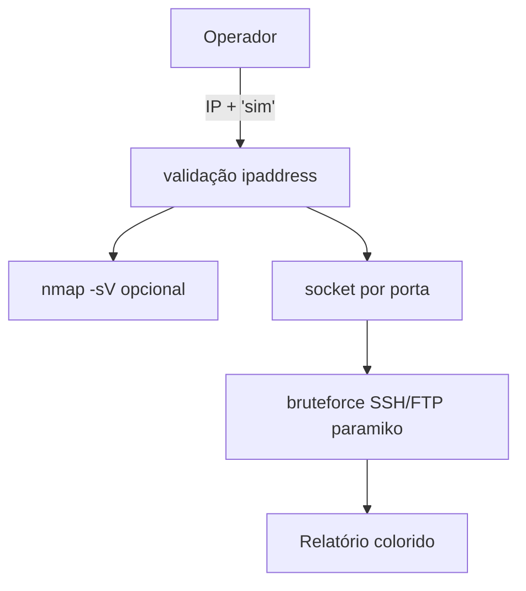

# 🔍 Network-Bruteforce-Scanner — Scanner de Rede (Lab)
<p align="center">
  
  <a href="https://github.com/panda12332145/Network-Bruteforce-Scanner/commits/main"></a>
  <a href="https://github.com/panda12332145/Network-Bruteforce-Scanner"></a>
  
</p>
---
> ⚠️ **Só redes e alvos que você tem autorização expressa para testar.** Varredura/bruteforce sem permissão é crime (art. 154-A / Marco Civil). Confirmação de alvo é exigida antes de qualquer execução.

---
## 🔖 Resumo

**Scanner de rede para laboratório** que combina **Nmap** (versão/serviços em portas clássicas), verificação de portas com `socket` e **bruteforce SSH/FTP** com *paramiko* usando wordlists genéricas. Valida o alvo com `ipaddress` (bloqueia injeção de argumentos), pede **confirmação explícita** antes de rodar e degrada com aviso amigável quando o `nmap` não está instalado.

### ✨ Funcionalidades Principais

- ✅ Validação de IP **antes** de qualquer subprocesso (anti injeção)
- ✅ Confirmação obrigatória 'digite sim' com aviso de lab
- ✅ Nmap opcional: sem binário → instrução de instalação, sem crash
- ✅ Verificação de portas SSH/FTP/HTTP/MySQL/RDP... com `socket`
- ✅ Wordlists genéricas de lab (nada pessoal)
- ✅ Saída colorida (ANSI) com resumo por serviço

## 📽 Demonstração

```text
$ python main.py
IP alvo: 192.168.56.101
⚠️  Confirme alvo LABORATÓRIO autorizado (192.168.56.101) [digite 'sim']: sim
🔍 Iniciando Nmap em 192.168.56.101...
[+] 22/tcp  open  ssh
[+] 21/tcp  open  ftp
```

## ⚙️ Explicação das Partes Importantes

### Validação de alvo (`src/main.py`)

```python
ip = ip.strip()
ipaddress.ip_address(ip)          # levanta ValueError cedo
if input("... [digite 'sim']: ").lower() != "sim":
    return                        # operador desistiu
```

> O alvo nunca chega crú ao argv do nmap/ssh — e humano confirma antes de tocar em rede.

### Degradação sem nmap

```python
if not shutil.which("nmap"):
    print("[!] Nmap não encontrado — instale com: sudo apt install nmap")
    return
```

> Ambiente sem nmap segue utilizável (só a etapa de serviço some).

## 🔄 Fluxo de Trabalho / Arquitetura



## 📂 Estrutura do Projeto

```plaintext
Network-Bruteforce-Scanner/
├── main.py               # CLI + validação/confirmacao
├── src/
│   ├── main.py           # orquestração do scan
│   ├── nmap_engine.py    # subprocesso do nmap
│   └── service_checker.py# portas + creds de lab
├── tests/test_scanner.py # 5 testes (sem rede externa)
├── requirements.txt      # paramiko
└── README.md
```

## 🛠️ Tecnologias

| Ferramenta | Uso |
|---|---|
| **Python 3** | Linguagem |
| **nmap** | Varredura de serviços |
| **paramiko** | SSH/FTP client |
| **ipaddress** | Validação de alvo |

## ▶️ Instalação

```bash
git clone https://github.com/panda12332145/Network-Bruteforce-Scanner.git
cd Network-Bruteforce-Scanner
pip install -r requirements.txt
sudo apt install nmap        # opcional mas recomendado
```

## 🚀 Execução

```bash
# Lab (máquina vulnerable própria tipo DVWA/Metasploitable):
python main.py
IP alvo: 192.168.56.101

# Testes (sem rede externa):
python tests/test_scanner.py
```

## 🧪 Testes

5 testes automatizados: mapa de serviços, wordlists de lab, porta fechada em localhost, REJEIÇÃO de alvo com injeção (`127.0.0.1; rm -rf /`) sem chegar em `input()`, constantes de cor.

## ⚠️ Limitações

- Bruteforce lento e sequencial (by design — sem threads de força bruta)
- Credenciais fixas de exemplo — troque pelo seu wordlist do lab
- Depende do nmap no PATH para a etapa de versão de serviço

## 🚀 Roadmap

- [ ] `--wordlist arquivo.txt`
- [ ] Relatório JSON
- [ ] Rate-limit entre tentativas
- [ ] Scan de rede inteiro (range CIDR)

## 📄 Licença

Todos os direitos reservados ao autor.

---

## 👾 Autor

<p align="center">
  
</p>

<p align="center">Feito por <strong>Panda12332145</strong> 👋🏽</p>

---

## 🧑‍💻 Sobre Mim

Sou apaixonado por **Física Teórica, Cibersegurança e Desenvolvimento de Sistemas**. Tenho grande interesse em programação de baixo nível, engenharia reversa, automação, sistemas Windows, criptografia e segurança ofensiva. Também gosto bastante de música, filosofia e computação avançada.

---

## 🌐 Redes

* **Site:** [https://panda-h0me.netlify.app/](https://panda-h0me.netlify.app/)
* **YouTube:** [https://www.youtube.com/@X86BinaryGhost](https://www.youtube.com/@X86BinaryGhost)
* **Instagram:** [https://www.instagram.com/01pandal10/](https://www.instagram.com/01pandal10/)
* **GitHub:** [https://github.com/panda12332145](https://github.com/panda12332145)
* **LinkedIn:** [linkedin.com/in/athos-da-boanergis](https://www.linkedin.com/in/athos-d%C3%A3-boanergis-5585a4288/)

---

## 🚀 Áreas de Interesse

* **Cibersegurança Avançada** 🔒
* **Hacking & Engenharia Reversa** 💻
* **Computação de Baixo Nível** 🖥️
* **Matemática e Física Teórica** 📐⚛️
* **Desenvolvimento de Ferramentas de Segurança** 🛠️

_"Conhecimento é poder, e domínio técnico vem da compreensão profunda dos sistemas."_

---

## 📞 Contato & Suporte

Para colaborações, dúvidas ou sugestões:

📧 **E-mail:** [athos.cybersec@gmail.com](mailto:athos.cybersec@gmail.com)

🐛 **Reportar Bug:** [Abrir Issue](https://github.com/panda12332145/Network-Bruteforce-Scanner/issues)

💡 **Sugerir Melhoria:** [Discussions](https://github.com/panda12332145/Network-Bruteforce-Scanner/discussions)
